# Phân tích API Gateway và Pipeline Nghiệp vụ trong Dự án Bookstore

Dựa trên mã nguồn thực tế của dự án (`api-gateway/app/views.py`, `api-gateway/app/middleware.py`), tài liệu này mô tả chi tiết vai trò của API Gateway, cách ứng dụng REST API và luồng xử lý cụ thể của các bước mua hàng.

---

## 1. Vai trò của API Gateway trong dự án hiện tại

Khác với các API Gateway thuần túy chỉ làm nhiệm vụ định tuyến (như Kong, Nginx), API Gateway trong dự án của bạn đang được thiết kế theo pattern **BFF (Backend For Frontend)**. Cụ thể:

- **Giao tiếp với Client (Trình duyệt):** Trực tiếp render HTML (các hàm `render(request, "store_home.html", ...)`) và quản lý session của người dùng (Customer Session).
- **Tập hợp dữ liệu (Data Aggregator):** Khi hiển thị một trang (ví dụ trang giỏ hàng `store_cart`), Gateway tự động gọi nhiều request đến các service khác nhau (gọi `cart-service` để lấy item, gọi `book-service` để mapping giá và tên sách) rồi gom lại hiển thị cho người dùng.
- **Bảo mật và Phân quyền (Security & RBAC):** Thông qua `JWTValidationMiddleware`, Gateway kiểm tra Rate Limit theo IP, trích xuất token (`access_token` từ session hoặc `Authorization` header), sau đó gọi sang `auth-service` (`/auth/validate/`) để xác thực và kiểm tra role (admin, customer, staff) cho các path được bảo vệ (`/store/profile/`, `/store/cart/`, v.v.).

---

## 2. Rest API thể hiện ở đâu?

Trong hệ thống này, REST API thể hiện rõ rệt nhất ở **giao tiếp nội bộ giữa API Gateway và các Microservices Backend**:

- Các service backend (`book-service`, `cart-service`, `order-service`, v.v.) phơi bày các endpoint chuẩn RESTful.
- API Gateway sử dụng thư viện `requests` của Python để đóng vai trò là một "REST Client" gọi đến các service này.
- **Ví dụ cụ thể trong code:**
  - **GET (Lấy dữ liệu):** `requests.get(f"{BOOK_SERVICE_URL}/books/")`
  - **POST (Tạo mới):** `requests.post(f"{CART_SERVICE_URL}/cart-items/", json=...)`
  - **PATCH (Cập nhật 1 phần):** `requests.patch(f"{ORDER_SERVICE_URL}/orders/{order_id}/", json={"status": "delivered"})`
  - **DELETE (Xóa):** `requests.delete(f"{CART_SERVICE_URL}/carts/{customer['id']}/clear/")`

---

## 3. Pipeline Chi Tiết: Tạo giỏ hàng -> Checkout -> Chọn Ship/Paid -> Order

Luồng này được thực thi chủ yếu trong các hàm `store_add_to_cart` và `store_checkout` của API Gateway.

### Bước 1: Tạo giỏ hàng (Add to Cart)
*Hàm xử lý: `store_add_to_cart`*
1. **Client:** Bấm nút "Thêm vào giỏ", gửi POST request chứa `book_id` và `quantity`.
2. **Gateway:**
   - Kiểm tra user đã đăng nhập chưa (có session `customer_id`).
   - Gọi GET `cart-service/carts/{customer_id}/` để lấy ID giỏ hàng hiện tại.
   - **Kiểm tra kho (Guard):** Gọi GET `book-service/books/{book_id}/` kiểm tra thuộc tính `stock` xem sách còn hàng không.
   - **Thêm vào giỏ:** Nếu hợp lệ, gọi POST `cart-service/cart-items/` để ghi vào cơ sở dữ liệu của cart.

### Bước 2: Checkout (Xác nhận giỏ hàng)
*Hàm xử lý: `store_checkout` (Khi request là POST)*
1. **Lấy giỏ hàng:** Gateway gọi `cart-service/carts/{customer_id}/` để lấy danh sách items. Nếu rỗng, báo lỗi.
2. **Kiểm tra và tính giá:** Gateway gọi `book-service/books/` để lấy giá mới nhất và số lượng kho hiện tại. Lặp qua từng item để tính `total_price`. Nếu có sách nào số lượng mua lớn hơn `stock`, quá trình dừng lại và báo lỗi.

### Bước 3: Trừ tồn kho (Reduce Stock)
*(Thực hiện ngay trong hàm `store_checkout` trước khi tạo đơn)*
- Gateway lặp qua danh sách mua, gọi POST `book-service/books/{book_id}/reduce-stock/` với số lượng tương ứng.
- **Rollback (Bù trừ):** Nếu một cuốn sách trừ kho thất bại, Gateway có cơ chế lặp qua các sách đã trừ thành công trước đó và gọi `PATCH` để cộng lại `stock` (giải quyết tình trạng nghẽn kho một phần).

### Bước 4: Chọn Ship và Chọn Paid (Xử lý thông tin form)
- Form checkout gửi lên `province`, `address_detail` (Chọn Ship) và `payment_method` (Chọn Paid - VD: `vnpay` hoặc `cod`).
- **Phí Ship:** Gateway tự tính logic phí ship cơ bản (Nếu khác "Hà Nội" hoặc "Hồ Chí Minh", `shipping_fee` = 30000, ngược lại = 0).

### Bước 5: Order (Tạo Đơn Hàng) & Xóa Giỏ Hàng
1. **Tạo Order:** Gateway gọi POST `order-service/orders/` gửi cục dữ liệu gồm `customer_id`, `items`, `total_price`, `shipping_fee`, địa chỉ và `payment_method`.
2. **Xóa Giỏ hàng:** Khi Order tạo thành công (Status 201), Gateway lập tức gọi DELETE `cart-service/carts/{customer_id}/clear/` để làm trống giỏ.
3. **Mô phỏng Thanh toán (Nếu chọn VNPay):**
   - Gateway gọi POST `pay-service/payments/` tạo một bản ghi thanh toán nháp (Status Pending).
   - Gateway không trả về trang thành công ngay mà render trang `store_vnpay_sim.html` để mô phỏng luồng chuyển hướng qua VNPay.
   - Sau khi user bấm xác nhận trên trang mô phỏng, Gateway (ở hàm `store_payment_simulate`) sẽ gọi `pay-service/payments/confirm-payment/` để chốt giao dịch.

---
**Tóm tắt:** Trong dự án này, API Gateway đóng vai trò là "Nhạc trưởng" trực tiếp (Orchestrator). Thay vì các service gọi chéo nhau bằng Message Queue (Saga pattern bất đồng bộ hoàn toàn), Gateway đang điều phối tuần tự (Synchronous REST): Lấy giỏ -> Trừ kho -> Tính tiền -> Tạo đơn -> Xóa giỏ.

---

## 4. Sequence Diagram: Pipeline Mua Hàng Đầy Đủ

```mermaid
sequenceDiagram
    actor Client as Khách hàng (Browser)
    participant GW as API Gateway :8000
    participant Auth as Auth Service
    participant Cart as Cart Service :8003
    participant Book as Book Service :8002
    participant Order as Order Service :8004
    participant Pay as Pay Service :8008

    %% ══════════════════════════════════════════
    %% BƯỚC 1 — Tạo giỏ hàng (Add to Cart)
    %% ══════════════════════════════════════════
    rect rgb(220, 240, 255)
        Note over Client,Cart: Bước 1 — Tạo giỏ hàng
        Client->>GW: POST /store/cart/add/  {book_id, quantity}
        GW->>Auth: Validate session → lấy customer_id
        Auth-->>GW: customer {id, name, ...}
        GW->>Cart: GET /carts/{customer_id}/
        Cart-->>GW: {cart_id, items[]}
        GW->>Book: GET /books/{book_id}/
        Book-->>GW: {id, title, price, stock}
        alt stock > 0
            GW->>Cart: POST /cart-items/  {cart, book_id, quantity}
            Cart-->>GW: 201 Created
            GW-->>Client: Redirect (✓ Đã thêm vào giỏ hàng!)
        else Hết hàng
            GW-->>Client: Error "Sách đã hết hàng"
        end
    end

    %% ══════════════════════════════════════════
    %% BƯỚC 2 — Checkout: lấy giỏ & kiểm tra kho
    %% ══════════════════════════════════════════
    rect rgb(255, 248, 220)
        Note over Client,Book: Bước 2 — Checkout (kiểm tra giỏ hàng & giá)
        Client->>GW: POST /store/checkout/  {province, address_detail, payment_method}
        GW->>Cart: GET /carts/{customer_id}/
        Cart-->>GW: {items: [{book_id, quantity}, ...]}
        alt Giỏ hàng rỗng
            GW-->>Client: Error "Giỏ hàng trống"
        end
        GW->>Book: GET /books/
        Book-->>GW: [{id, title, price, stock}, ...]
        Note over GW: Tính total_price = Σ(price × qty)<br/>Kiểm tra stock từng sách
        alt Có sách không đủ tồn kho
            GW-->>Client: Error "Không đủ hàng (Còn lại: N)"
        end
    end

    %% ══════════════════════════════════════════
    %% BƯỚC 3 — Trừ tồn kho (Stock Reservation)
    %% ══════════════════════════════════════════
    rect rgb(255, 230, 230)
        Note over GW,Book: Bước 3 — Trừ tồn kho (trước khi tạo đơn)
        loop Mỗi sách trong đơn hàng
            GW->>Book: POST /books/{book_id}/reduce-stock/  {quantity}
            Book-->>GW: 200 OK
        end
        alt Trừ kho thất bại (giữa chừng)
            Note over GW,Book: Rollback — hoàn trả stock các sách đã trừ
            loop Mỗi sách đã trừ thành công
                GW->>Book: GET /books/{book_id}/
                Book-->>GW: {stock: N}
                GW->>Book: PATCH /books/{book_id}/  {stock: N + qty}
                Book-->>GW: 200 OK
            end
            GW-->>Client: Redirect store_cart (có lỗi trừ kho)
        end
    end

    %% ══════════════════════════════════════════
    %% BƯỚC 4 — Chọn Ship & Chọn Paid (logic tại Gateway)
    %% ══════════════════════════════════════════
    rect rgb(235, 255, 235)
        Note over GW: Bước 4 — Chọn Ship & Chọn Paid (xử lý trong form)
        Note over GW: province → tính shipping_fee:<br/>  Hà Nội / Hồ Chí Minh → 0 đ<br/>  Tỉnh / thành khác   → 30.000 đ<br/>payment_method ∈ { cod, vnpay }
    end

    %% ══════════════════════════════════════════
    %% BƯỚC 5 — Tạo đơn hàng & Xóa giỏ
    %% ══════════════════════════════════════════
    rect rgb(245, 235, 255)
        Note over GW,Cart: Bước 5 — Tạo đơn hàng & Xóa giỏ
        GW->>Order: POST /orders/  {customer_id, items, total_price,<br/>shipping_fee, shipping_address, payment_method}
        alt Tạo đơn thành công
            Order-->>GW: 201 Created  {order_id, grand_total, status:"pending"}
            GW->>Cart: DELETE /carts/{customer_id}/clear/
            Cart-->>GW: 204 No Content
        else Tạo đơn thất bại
            Note over GW,Book: Rollback stock toàn bộ
            loop Mỗi sách trong đơn
                GW->>Book: PATCH /books/{book_id}/  {stock: N + qty}
                Book-->>GW: 200 OK
            end
            GW-->>Client: Error "Lỗi tạo đơn hàng"
        end
    end

    %% ══════════════════════════════════════════
    %% BƯỚC 6a — Thanh toán COD
    %% ══════════════════════════════════════════
    alt payment_method = "cod"
        rect rgb(225, 255, 240)
            Note over Client,GW: Bước 6a — Thanh toán COD
            GW-->>Client: Render store_success.html  (✓ Đặt hàng thành công!)
        end

    %% ══════════════════════════════════════════
    %% BƯỚC 6b — Thanh toán VNPay (Simulation)
    %% ══════════════════════════════════════════
    else payment_method = "vnpay"
        rect rgb(255, 243, 220)
            Note over Client,Pay: Bước 6b — Thanh toán VNPay (Simulation)
            GW->>Pay: POST /payments/  {order_id, customer_id, amount, method:"vnpay"}
            Pay-->>GW: 201 Created  {payment_id, transaction_id, status:"pending"}
            GW-->>Client: Render store_vnpay_sim.html  (Trang mô phỏng cổng VNPay)
            Client->>GW: POST /store/payment/simulate/{order_id}/  (User bấm "Xác nhận")
            GW->>Pay: GET /payments/order/{order_id}/
            Pay-->>GW: [{transaction_id, status:"pending", ...}]
            GW->>Pay: POST /payments/confirm-payment/  {order_id, transaction_id, secure_token}
            Pay-->>GW: 200 OK  (Thanh toán xác nhận, status:"completed")
            GW-->>Client: Redirect → store_order_detail  (✓ Thanh toán thành công!)
        end
    end
```

